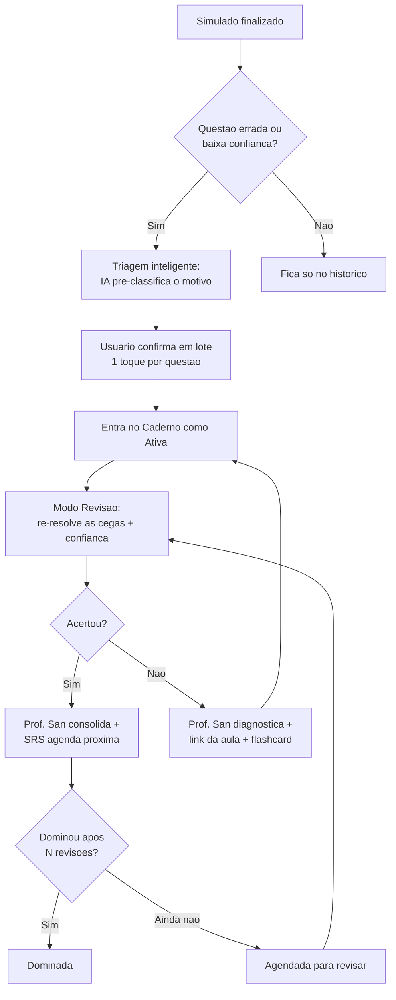
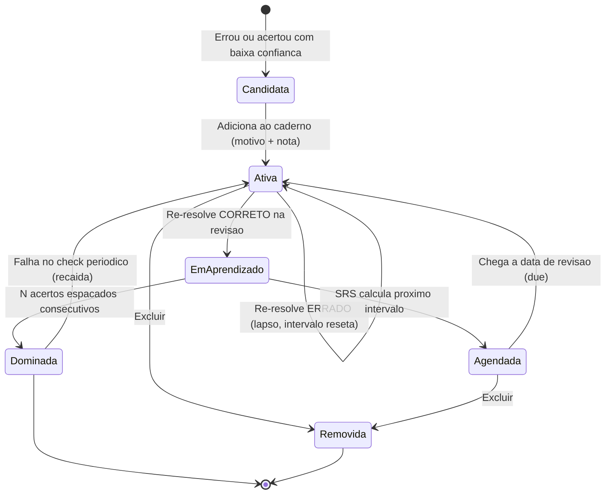

# Caderno de Erros — Análise Comparativa & Visão Definitiva

**Produto:** SanarFlix PRO Simulados (ENAMED)
**Escopo:** Diagnóstico do estado atual · Benchmark Medway · Síntese comparativa · Feature ideal · Inovações · Roadmap
**Status:** Documento estratégico para circular com Design e Engenharia
**Data:** Junho/2026

---

## TL;DR — A tese central

> **Hoje temos o melhor "cérebro" do mercado (taxonomia de causa do erro + Prof. San + revisão ativa por sessão) embrulhado numa "casca" inconsistente. A Medway tem a melhor "casca-hub" (erros + favoritos + anotações + flashcards com imagem, tudo num lugar) mas sem nenhum cérebro pedagógico. A versão definitiva une o cérebro SanarFlix à casca-hub Medway — e adiciona as três coisas que faltam aos dois: recall ativo de verdade, repetição espaçada de verdade, e diagnóstico que olha ENTRE os erros, não só dentro de cada um.**

Quatro decisões de maior alavancagem, em ordem:

1. **Resolver o fork interno.** Existem hoje duas implementações divergentes: a produção (com sessão de revisão + Prof. San) e o protótipo `src/sandbox/caderno` (mais bonito, hero-first, porém **sem sessão e sem Prof. San**). A versão definitiva = casca do sandbox + cérebro da produção. Não escolher um dos dois; fundir.
2. **Recall ativo.** Hoje "Já dominei" é autodeclarado — o aluno *lê* a questão, não *re-resolve*. Trocar por re-resolução às cegas com captura de confiança é o maior salto pedagógico possível e nenhum dos dois concorrentes faz.
3. **SRS real.** Hoje o agendamento é um snooze manual (1/3/7 dias escolhidos pela mão). Trocar por um motor de repetição espaçada adaptativo (FSRS/SM-2) modulado pela causa do erro.
4. **Motor de padrões.** Nem SanarFlix nem Medway olham *entre* os erros. "Você confunde IAM × angina recorrentemente" e "62% dos seus erros em Cardio são desatenção, não conteúdo" é o diferencial que vira retenção.

---

## 1. Diagnóstico do estado atual — SanarFlix

### 1.1 O que existe hoje (produção)

O Caderno de Erros é uma feature **exclusiva PRO**, com página dedicada (`/caderno-erros`), gate por `useHasAccess('cadernoErros')` e ponto de entrada na correção do simulado.

**Modelo de dados (`error_notebook`)** — rico e bem pensado:

| Campo | Função |
|---|---|
| `question_id`, `simulado_id`, `question_number`, `question_text` (500 ch), `area`, `theme`, `simulado_title` | Metadados desnormalizados (acesso rápido sem joins) |
| `reason` (enum) | **Causa do erro** — diferencial pedagógico central |
| `learning_text` (≤300 ch) | Anotação pessoal do aluno |
| `was_correct` | Permite registrar acertos "no chute" |
| `resolved_at`, `deleted_at`, `next_review_at` | Ciclo de vida (resolvido / soft-delete / snooze) |
| `ai_review_md`, `ai_review_generated_at`, `ai_practice`, `ai_option_rationales`, `chat_count` | Camada de IA (Prof. San), cacheada por entrada |

**Taxonomia de causa do erro** (`errorNotebookReasons.ts`) — o ativo mais valioso do produto. Cada motivo carrega rótulo, dica, **estratégia de estudo** e cor:

| Enum DB | Badge | Significado | Estratégia mapeada |
|---|---|---|---|
| `did_not_know` | Lacuna | Nunca vi / não domino | Assistir aula do tema no SanarFlix |
| `did_not_remember` | Memória | Sabia, mas esqueci | Construir flashcards / revisão espaçada 1·3·7 |
| `reading_error` | Atenção | Não vi o detalhe ("EXCETO", "sem febre") | Técnica de prova — sublinhar palavra-chave |
| `confused_alternatives` | Diferencial | Confundi com condição parecida | Estudo comparativo lado a lado |
| `guessed_correctly` | Chute | **Acertei sem certeza** | Tratar como lacuna |
| `did_not_understand` | Entend. | (legado) | — |

> Capturar **acerto com baixa certeza** (`guessed_correctly`) é uma sacada metacognitiva que a Medway não tem.

**Tela principal:** hero status (pendentes / resolvidas / total / streak / nº especialidades + barra de progresso) → filtros (motivo + especialidade) → seções *Pendentes* / *Agendadas para revisar* / *Resolvidas* (colapsável) → CTA hero "Modo revisão com Prof. San".

**Fluxo de adição:** modal de 2 passos (escolher motivo → nota opcional), disparado na correção. Seleção de texto na explicação pré-preenche a nota. Detecção de duplicata. Aceita acertos.

**Modo Revisão (`CadernoRevisaoPage`)** — sessão sequencial, questão a questão:
- Filtra não-resolvidas **e** vencidas (`next_review_at <= now`), ordena por nº da questão.
- Mostra questão, alternativas com cor (correta/escolhida/demais), resposta do aluno e a análise da IA.
- Ações: **"Já dominei"** (resolve), **snooze** (1/3/7d), **remover**. Atalhos `←→`, `D`, `J`, `R`.
- Tracking de sessão (dominadas, áreas, tempo) → tela de resumo com top-3 áreas + CTA "treinar mais".
- Painel lateral de fila (desktop), streak de sessão e de dias.

**Prof. San (IA)** — dois modos, via edge functions Gemini:
- *Análise*: markdown em 3 blocos (🎯 o que cobra · 🧠 por que o gabarito · 📌 pra não repetir) + racional por alternativa + sugestão de prática (tema/área/qtd). Cacheado.
- *Chat*: Q&A interativo, limite 10/entrada, recusa off-topic, ancorado em dado clínico, cita trials/classificações.

### 1.2 O fork interno (atenção, Design+Eng)

Existe um redesign em `src/sandbox/caderno` (UI-only, mock data, sem backend) que propõe uma direção **muito melhor de casca**: hero-first com stats, card "**Próxima para revisar**", entry cards compactos e escaneáveis, filtros em duas faixas, `EmptyState` e `ZeroPendingState` ("Caderno zerado 🎯") celebratórios.

**Porém o sandbox jogou fora o cérebro:** não há modo sessão, não há Prof. San, não há snooze/agendamento. Adotá-lo como está seria um **downgrade pedagógico**. A decisão correta é fundir: **casca do sandbox + motor da produção**.

### 1.3 Pontos fortes

- Taxonomia de **causa do erro** com estratégia acionável por tipo — raro no mercado.
- **Prof. San**: análise personalizada + chat contextual com guard-rails clínicos.
- Revisão como **sessão com ritmo** (atalhos, fila, resumo, streak).
- Página dedicada com URL, gate PRO limpo, soft-delete, undo, optimistic updates.
- Captura de **acerto sem certeza** (metacognição).

### 1.4 Lacunas e problemas conhecidos

| # | Lacuna | Impacto |
|---|---|---|
| G1 | **Sem recall ativo** — "dominei" é autodeclarado, aluno só lê | Alto — fere a eficácia comprovada de active recall |
| G2 | **Sem SRS real** — snooze manual 1/3/7 escolhido à mão | Alto — sem espaçamento adaptativo, esquecimento volta |
| G3 | **Adição só manual**, uma a uma, na correção | Alto — atrito mata o hábito; erros não viram entradas |
| G4 | **Sem busca** no caderno | Médio |
| G5 | **Sem flashcards** (apesar de a estratégia citá-los) | Alto — promessa não cumprida |
| G6 | **Sem análise entre erros** (padrões, áreas fracas, confusões recorrentes) | Alto — diferencial não explorado |
| G7 | **Sem ações em lote / quick actions na lista** | Médio |
| G8 | **Revisão mobile fraca** (painel de fila é desktop-only) | Médio — público estuda no celular |
| G9 | **Nota ≤300 ch, texto plano** | Médio |
| G10 | **Sem prova de ROI** ("o caderno está funcionando?") | Médio — engajamento de longo prazo |
| G11 | **Sem export** (Anki/PDF) | Baixo |
| G12 | **Fork produção × sandbox** não resolvido | Alto — débito de produto |

---

## 2. Análise do benchmark — Medway ("Meu Caderno")

A Medway tratou o caderno como **hub de revisão pessoal**: um modal com 3 abas — **Caderno de Erros + Favoritos + Anotações** (com badges de contagem) — mais criação de **flashcards** a partir de qualquer card.

### 2.1 O que fazem bem

| # | Acerto | Por que importa |
|---|---|---|
| M1 | **Hub unificado** (erros + favoritos + anotações num lugar) | Consolida "o que revisar" — reduz dispersão entre features |
| M2 | **Flashcards nativos com imagem (frente E verso)** | Ouro para medicina (ECG, imagem, esquema); puxa de qualquer card |
| M3 | **Editor de nota rich-text** (negrito, listas, recuo) | Anotação clínica estruturada de verdade |
| M4 | **Busca textual** dentro do caderno | Escala quando passa de dezenas de itens |
| M5 | **Filtro "Categorias" por intenção** (Critérios · Pegadinhas · Decorar · Revisar) | "Revisão por intenção" — caderno vira material estratégico, não lista cronológica |
| M6 | **Tag de dificuldade/prevalência** ("Média prev.") | Contexto que ajuda a priorizar |
| M7 | **Favoritos** independentes de erro | Curadoria de questões de alto valor |
| M8 | **Card denso e em camadas** (onde · o quê · performance · ação) + data relativa | Boa densidade informacional |
| M9 | **Filtro por especialidade com ícones médicos** | Escaneabilidade e identidade |

### 2.2 O que fazem mal / incompleto

| # | Problema | Severidade |
|---|---|---|
| m1 | **Arquitetura em modal** — sem URL, sem bookmark, sem deep-link, inconsistente com o resto do produto | Alta |
| m2 | **Filtro de especialidade sem estado ativo visível** (clica e nada muda visualmente) | Alta |
| m3 | **Editor inconsistente**: modal centralizado (Anotações) × slide-over (Erros), com botão "Salvar" cortado fora da viewport | Alta (crítica) |
| m4 | **Sem confirmação de exclusão** | Alta |
| m5 | **Sem feedback de sucesso** (toast) ao salvar/criar | Alta |
| m6 | **Nomenclatura de filtro muda entre abas** ("Categorias" / "Focos" / "Tipos") sem explicação | Média |
| m7 | **Flashcard não pré-preenche** nada da questão de origem (copiar/colar manual) | Média |
| m8 | **Categorização é só intenção manual** — não há causa do erro nem nada automático | Conceitual |
| m9 | **Sem título nas anotações**; notas longas estouram a lista | Média |
| m10 | **Inconsistência de badges/estrutura entre abas**; favoritos sem "Editar"/"Acessar" | Média |
| m11 | **Sem paginação / "mostrando X de 64"**; ordem da lista não comunicada | Média |
| m12 | **Modal-dentro-de-modal** (criar deck dentro do criar-card) | Média |
| m13 | **Acessibilidade**: contraste baixo, sem tooltip em ícones, sem dica de Esc | Média |
| m14 | **Sem skeleton** (só "Carregando…" no fim da lista) | Baixa |

### 2.3 Diferenciador real × apenas diferente

- **Diferenciadores reais (vale copiar):** flashcards com imagem (M2), hub unificado (M1), editor rich-text (M3), busca (M4), tag de prevalência (M6), favoritos (M7).
- **Apenas diferente / pior (não copiar):** modal sem URL (m1), nomenclatura de filtro divergente (m6), editor com 2 comportamentos (m3), filtro sem feedback (m2). São anti-padrões — nossa arquitetura de página dedicada já é superior.
- **Conceitualmente inferior:** a categorização da Medway é **intenção manual** ("decorar/revisar"). A nossa é **causa diagnóstica do erro**. A nossa é mais poderosa — mas a deles é *mais leve de preencher*. A síntese ideal usa **causa do erro com pré-classificação automática** (o melhor dos dois).

---

## 3. Síntese comparativa

### 3.1 Matriz lado a lado

| Capacidade | SanarFlix (hoje) | Medway | Quem vence | Na versão ideal |
|---|---|---|---|---|
| Arquitetura de navegação | ✅ Página + URL + gate PRO | ⚠️ Modal sem URL | **SanarFlix** | Página + URL + hub por abas |
| Classificação da entrada | ✅ **Causa do erro** (6 tipos) + estratégia | ⚠️ Intenção manual (4 tags) | **SanarFlix** | Causa do erro **auto-sugerida** |
| Tutor IA | ✅ **Prof. San** (análise + chat) | ❌ Nenhum | **SanarFlix** | Prof. San micro **e macro** |
| Revisão | ✅ Sessão com ritmo + atalhos | ❌ Só lista | **SanarFlix** | Sessão + **recall ativo** |
| Agendamento | ⚠️ Snooze manual 1/3/7 | ❌ Nenhum | SanarFlix (fraco) | **SRS adaptativo** |
| Hub unificado (erros+fav+notas) | ❌ Só erros | ✅ 3 abas | **Medway** | 3 abas (erros · favoritos · notas) |
| Flashcards | ❌ Nenhum | ✅ **Com imagem** | **Medway** | Flashcards + **IA gera o card** |
| Editor de nota | ⚠️ Texto plano ≤300 | ✅ Rich-text | **Medway** | Rich-text + título + autosave |
| Busca | ❌ | ✅ | **Medway** | Busca + filtros combináveis |
| Tag de prevalência/peso | ❌ | ✅ | **Medway** | Peso na prova (ENAMED) |
| Favoritos | ❌ | ✅ | **Medway** | Aba Favoritos |
| Gamificação (streak) | ✅ Streak + resumo | ❌ | **SanarFlix** | Streak + metas + ROI |
| Estados vazios/celebratórios | ✅ (sandbox) | ❌ | **SanarFlix** | Mantém |
| Ações em lote | ❌ | ❌ | — | ✅ Novo |
| **Recall ativo** | ❌ | ❌ | **ambos falham** | ✅ Diferencial |
| **SRS de verdade** | ❌ | ❌ | **ambos falham** | ✅ Diferencial |
| **Análise entre erros** | ❌ | ❌ | **ambos falham** | ✅ Diferencial |
| Triagem automática pós-prova | ❌ | ❌ | **ambos falham** | ✅ Diferencial |
| Prova de ROI / analytics | ❌ | ❌ | **ambos falham** | ✅ Diferencial |
| Mobile | ⚠️ Revisão parcial | ⚠️ Modal apertado | ambos fracos | ✅ Paridade total |
| Acessibilidade | ⚠️ ok | ⚠️ contraste/tooltip | — | ✅ WCAG AA |

### 3.2 Leitura estratégica

- **Onde se sobrepõem:** caderno de erros com categorização, filtro por especialidade, metadados de questão, nota pessoal, conceito de flashcard.
- **Onde SanarFlix supera:** profundidade pedagógica (causa do erro + estratégia), IA (Prof. San), revisão ativa por sessão, arquitetura com URL, metacognição (chute).
- **Onde Medway supera:** amplitude de hub (3 conteúdos), flashcards com imagem, edição rich-text, busca, prevalência, favoritos.
- **Onde os dois falham (nosso espaço em branco):** recall ativo, SRS real, diagnóstico entre erros, triagem automática, prova de ROI, mobile de primeira.

---

## 4. Visão da feature ideal — versão definitiva

### 4.1 Princípios de produto

1. **Erro é matéria-prima, não lápide.** Todo erro deve virar uma entrada rastreável com o menor atrito possível — idealmente sem o aluno precisar lembrar de adicionar.
2. **Dominar ≠ ler de novo.** Domínio só é declarado quando o aluno **re-resolve corretamente, espaçado no tempo**.
3. **O sistema agenda, o aluno só aparece.** Repetição espaçada decide o "quando"; o aluno decide o "agora ou depois".
4. **Diagnóstico acima do item.** O maior valor não está em explicar UMA questão, mas em revelar o PADRÃO de erros.
5. **Fechar o loop dentro do ecossistema Sanar.** Erro → diagnóstico → **aula/flashcard SanarFlix** → re-teste. Esse loop é um fosso que a Medway-standalone não copia fácil.
6. **Uma casca, três conteúdos.** Página dedicada (URL), com abas: **Erros · Favoritos · Anotações** + visão **Insights**.

### 4.2 Arquitetura de informação (a "casca")

```
/caderno  (página dedicada, PRO)
├── [aba] Revisar (default)      ← erros + recall ativo + SRS
│     ├── Hero: stats + progresso + streak + "faltam N dias p/ ENAMED"
│     ├── Card "Para revisar agora" (devidos hoje)  ← CTA primário
│     ├── Fila: Devidas hoje · Em aprendizado · Agendadas · Dominadas
│     └── Filtros: causa do erro · especialidade · busca · status
├── [aba] Favoritos              ← curadoria (Medway M7)
├── [aba] Anotações              ← rich-text + título (Medway M3)
├── [aba] Flashcards             ← decks com imagem (Medway M2 + IA)
└── [aba] Insights               ← diagnóstico entre erros (inovação)
```

A casca herda o **hero-first do sandbox** (`PageHero`, `HeroNextCard`, `EntryCard`, `ZeroPendingState`) e re-acopla o **motor da produção** (sessão + Prof. San + agendamento).

### 4.3 Fluxo ponta a ponta



### 4.4 Ciclo de vida de uma entrada (com SRS + recall ativo)



### 4.5 As três mudanças de motor (núcleo do redesign)

**A) Recall ativo na revisão.** O Modo Revisão deixa de mostrar a resposta de cara. Sequência:
1. Mostra **só o enunciado + alternativas** (sem destaque, sem gabarito).
2. Aluno **re-marca** uma alternativa + um slider de **confiança** (baixa/média/alta).
3. **Revela** correção + análise do Prof. San (já temos o conteúdo).
4. Aluno **autoavalia o esforço** (Errei · Difícil · Bom · Fácil) → alimenta o SRS.
5. "Dominada" deixa de ser botão autodeclarado: emerge de **acertos espaçados consecutivos com confiança alta**.

> Mantém os atalhos atuais (`D`/`J`/`R`/`←→`) e adiciona `1-4` para a autoavaliação e `A-E` para marcar alternativa.

**B) SRS adaptativo (substitui o snooze).** Motor FSRS/SM-2 com `ease`, `interval`, `repetitions`, `lapses`, `due_at`. **A causa do erro modula a curva:**
- *Lacuna* → primeiro força a aula, depois intervalos curtos.
- *Memória* → curva clássica de espaçamento.
- *Atenção* → re-teste rápido (o conteúdo o aluno sabe; o erro é processo).
- *Diferencial* → re-teste com a condição irmã ao lado.
- *Chute* → tratada como lacuna até a confiança subir.

O snooze manual vira um override ("adiar"), não o mecanismo principal.

**C) Triagem automática pós-prova (mata o atrito de adicionar).** Ao finalizar o simulado, uma tela "**Transforme seus erros em plano de estudo**" lista as questões erradas + acertos de baixa confiança, **já pré-classificadas pela IA** num motivo provável. O aluno confirma/ajusta em lote (1 toque cada) e adiciona tudo de uma vez. Acaba o "adicionar uma a uma".

### 4.6 Estados de interface (telas-chave)

| Estado | O que mostra |
|---|---|
| **Loading** | Skeleton (herda do sandbox) |
| **Vazio (nunca adicionou)** | `EmptyState`: "Seu Caderno está vazio" + CTA p/ simulados |
| **Dashboard ativo** | Hero (stats + progresso + streak + countdown ENAMED) → "Para revisar agora" → fila segmentada → filtros/busca |
| **Zero pendentes (em dia)** | `ZeroPendingState`: "Caderno zerado 🎯" + próxima data devida + sugestão de treino |
| **Filtro sem resultado** | Mensagem + "limpar filtros" |
| **Sessão de revisão** | Recall ativo: enunciado → marcar+confiança → revelar+Prof. San → autoavaliação → próxima |
| **Resumo de sessão** | Dominadas/agendadas/restantes/tempo + top-3 áreas + insight macro + CTA |
| **Insights** | Padrões entre erros, áreas fracas, confusões recorrentes, ROI |
| **Flashcards** | Decks, revisão SRS, imagem frente/verso, card gerado por IA |

### 4.7 Hierarquia de informação do card (unificada)

Resolve as inconsistências da Medway (m6, m10) padronizando **um** componente de card para todas as abas:

```
[barra de cor = causa do erro] 
  Linha 1:  Q{n} · {Área › Tema}            [badge causa]  [peso ENAMED]
  Linha 2:  {Instituição/Prova} · {data relativa}
  Linha 3:  preview do enunciado (expansível inline — corrige Medway)
  Linha 4:  "Sua resposta → Correta"  +  nota do aluno (se houver)
  Rodapé:   [Revisar] [Flashcard] [Aula] [⋯ editar/excluir]   + status SRS ("volta em 3d")
```

Princípios: estado ativo **sempre** visível em filtros (corrige m2); exclusão **sempre** com confirmação + undo (corrige m4); toda ação com **toast** de sucesso (corrige m5); ícones **sempre** com label/tooltip (corrige m13).

---

## 5. Inovações originais — o que não existe em lugar nenhum

### 5.1 Alta convicção (entram no roadmap)

**I1 — Motor de Padrões ("Prof. San macro").** O Prof. San de hoje explica UMA questão. O macro analisa o caderno + histórico inteiro e devolve diagnósticos do tipo:
- *"62% dos seus erros em Cardio são desatenção, não conteúdo — seu problema é processo de prova, não estudo."*
- *"Você confunde IAM × angina instável em 4 questões. Aqui está a tabela diferencial."*
- *"Seu calcanhar é Nefro: 1 acerto em 7. Sugiro 3 aulas + 20 questões."*

Nenhum dos dois concorrentes olha **entre** os erros. Este é o diferencial que vira retenção.

**I2 — Flashcard gerado por IA a partir do erro.** Junta o flashcard-com-imagem da Medway (M2) com o Prof. San: a IA **rascunha frente/verso** a partir da questão + da própria análise, **traz a imagem** da questão, e o aluno só revisa e salva no deck SRS. Resolve o m7 da Medway (pré-preenchimento) com folga.

**I3 — Plano de revisão por contagem regressiva ("War Room ENAMED").** Conforme a prova se aproxima, o caderno monta um plano dia-a-dia priorizando por `frequência do erro × peso do tema no ENAMED × tempo desde a última revisão × ainda-não-dominado`. *"Faltam 14 dias: hoje, domine estas 12."* Transforma o caderno passivo num **coach de reta final**.

**I4 — Captura de confiança na origem + dashboard de calibração.** Capturar a **certeza no momento da resposta** (dentro do simulado), não só na revisão. Isso (a) alimenta a triagem automática (acertos "no chute" entram sozinhos) e (b) gera um **dashboard de calibração**: "você acha que sabe, mas acerta 40% — overconfidence em Endócrino". Metacognição é o que separa o aluno bom do aprovado.

**I5 — Deep-link cirúrgico para a aula/segundo exato.** Cada *Lacuna* aponta para a **aula SanarFlix + timestamp** do tema. Fecha o loop erro→estudo dentro do ecossistema. É um fosso estrutural: a Medway, sem o catálogo SanarFlix, não replica.

**I6 — Prova de ROI do caderno.** Painel que correlaciona domínio no caderno × desempenho nos simulados seguintes, por área. *"Temas que você dominou aqui: +18% de acerto nos simulados seguintes."* Mostrar que funciona é o que sustenta o hábito (e justifica o PRO).

### 5.2 Moonshots (avaliar pós-MVP)

**I7 — Micro-revisão mobile / por voz.** Sessões de 5 min no transporte: Prof. San **lê** a análise (TTS), flashcards por swipe de uma mão. Corrige a fraqueza mobile dos dois produtos.

**I8 — Detector de "leech".** Questão/tema reprovado N vezes vira **leech** e dispara intervenção diferente (aula obrigatória antes do próximo re-teste, ou Prof. San muda a abordagem). Conceito do Anki que nenhum dos dois tem.

**I9 — Decks colaborativos / cohort.** Compartilhar um conjunto curado de erros com o grupo de estudo; "alunos que dominaram este tema subiram X em Cardio" (puxa do comparativo que já existe para standard/PRO).

**I10 — Modo "simulado do meu caderno".** Gera um mini-simulado cronometrado **só com variações dos temas que você mais erra** — recall ativo em contexto de prova real, não card isolado.

**I11 — Export Anki / PDF.** Para o público que vive no Anki, exportar deck (.apkg) e resumo PDF da reta final. Baixa prioridade, alta fidelização de power users.

---

## 6. Plano de implementação

### 6.1 Critérios de priorização

Pontuação por **(Impacto pedagógico × Alcance) ÷ Esforço**, com bônus de **Diferenciação/fosso**. Ordem de desempate: resolver débito de produto (fork) > paridade competitiva > inovação.

### 6.2 Fase 0 — Fundação e decisão (1 sprint)

| Item | Entrega |
|---|---|
| Resolver o fork | Decisão registrada: **casca sandbox + motor produção**. Migrar `src/sandbox/caderno` para componentes de produção, re-acoplando sessão + Prof. San. |
| Modelo de dados | Migração `error_notebook`: + `srs_ease`, `srs_interval`, `srs_reps`, `srs_lapses`, `srs_due_at`, `confidence_at_answer`, `last_review_outcome`, `mastered_at`. Nova tabela `review_attempts` (re-resoluções). |
| Telemetria | Eventos de funil: triagem → adição → sessão → recall → domínio → ROI. |

**Dependência crítica:** I4 (confiança na origem) exige tocar o **fluxo de prova** (`useExamFlow`, `answers`). Decidir já se entra agora (recomendado) ou depois — é a única dependência *upstream*.

### 6.3 Fase 1 — MVP da versão definitiva (foco: pedagogia + atrito)

**Tese: o que torna o caderno melhor que os dois concorrentes não é UI, é o motor.**

| Prioridade | Item | Origem | Depende de |
|---|---|---|---|
| P0 | Casca unificada (hero-first + fila segmentada + estados) | Fork resolvido | Fase 0 |
| P0 | **Recall ativo** na revisão (re-resolve + confiança + autoavaliação) | Inovação (G1) | `review_attempts` |
| P0 | **SRS adaptativo** modulado por causa do erro (substitui snooze) | Inovação (G2) | campos SRS |
| P0 | **Triagem automática pós-prova** + adição em lote | Inovação (G3) | edge fn classificador |
| P1 | Busca + filtros combináveis + estado ativo visível | Medway (M4, m2) | — |
| P1 | Ações em lote + quick actions na lista + confirmação/undo + toasts | Medway (m4,m5) | — |
| P1 | Paridade mobile da sessão | G8 | — |

**Saída da Fase 1:** o caderno já é, isolado, superior a SanarFlix-hoje e a Medway em profundidade pedagógica.

### 6.4 Fase 2 — Hub + diagnóstico (foco: amplitude + diferencial)

| Prioridade | Item | Origem | Depende de |
|---|---|---|---|
| P0 | **Motor de Padrões / aba Insights** | Inovação I1 | dados de Fase 1 |
| P0 | **Flashcards com imagem + geração por IA** | Medway M2 + Inov. I2 | bucket storage; tabelas `decks`/`cards` |
| P1 | Deep-link aula/timestamp por Lacuna | Inovação I5 | mapa tema→aula (conteúdo) |
| P1 | Aba Favoritos | Medway M7 | — |
| P1 | Aba Anotações rich-text + título + autosave | Medway M3, m9 | editor |
| P2 | Tag de peso/prevalência ENAMED no card | Medway M6 | metadado de questão |
| P2 | Dashboard de calibração de confiança | Inovação I4 | confiança na origem (F0) |

### 6.5 Fase 3 — Coach de reta final + prova de valor

| Prioridade | Item | Origem |
|---|---|---|
| P0 | **War Room ENAMED** (plano por contagem regressiva) | Inovação I3 |
| P0 | **Painel de ROI** do caderno | Inovação I6 |
| P1 | Detector de leech | Inovação I8 |
| P1 | "Simulado do meu caderno" | Inovação I10 |
| P2 | Micro-revisão mobile / voz | Inovação I7 |
| P2 | Decks colaborativos / cohort | Inovação I9 |
| P3 | Export Anki / PDF | Inovação I11 |

### 6.6 Mapa de dependências técnicas (resumo)

- **Confiança na origem (I4)** → upstream em `useExamFlow`/`answers`. *Plicar cedo se quiser triagem e calibração robustas.*
- **SRS** → campos novos em `error_notebook` + RPC de agendamento (`schedule_next_review`) + `review_attempts`. Alimenta War Room (I3) e leech (I8).
- **Recall ativo** → reusa questão+opções já carregadas na revisão; grava outcome em `review_attempts`.
- **Triagem (I-pós-prova)** e **Prof. San macro (I1)** → edge functions (padrão Gemini já existente). Macro precisa de query agregada sobre `error_notebook` + `attempt_question_results`.
- **Flashcards (M2/I2)** → tabelas `decks`/`flashcards` + Supabase Storage (imagens) + SRS compartilhado com o caderno.
- **Deep-link aula (I5)** → mapeamento `theme → aula/timestamp` no catálogo SanarFlix (dependência de conteúdo, não só de eng).
- **War Room (I3)** e **ROI (I6)** → dependem de dados acumulados das Fases 1–2; entram por último por isso.

### 6.7 Princípio de sequenciamento

> Fase 1 prova a **tese pedagógica** (motor). Fase 2 entrega **amplitude** (hub) e o **diferencial de diagnóstico**. Fase 3 entrega o **coach de reta final** e a **prova de ROI** — que só fazem sentido sobre dados já acumulados. Cada fase é, por si só, um caderno superior ao de ambos os concorrentes.

---

## Apêndice A — Resumo de mudanças no modelo de dados

```
error_notebook  (+ colunas)
  srs_ease            float    -- fator de facilidade (FSRS/SM-2)
  srs_interval        int      -- intervalo atual (dias)
  srs_reps            int      -- repetições corretas consecutivas
  srs_lapses          int      -- nº de lapsos (vira leech acima de limite)
  srs_due_at          timestamptz  -- substitui next_review_at como fonte de verdade
  confidence_at_answer  text   -- baixa|media|alta (capturado na prova)
  last_review_outcome   text   -- errei|dificil|bom|facil
  mastered_at         timestamptz  -- distinto de resolved_at (auto, não autodeclarado)

review_attempts (nova)
  id, entry_id, user_id, selected_option_id, was_correct,
  confidence, self_grade, reviewed_at

decks / flashcards (novas, Fase 2)
  deck: id, user_id, name
  flashcard: id, deck_id, user_id, entry_id?, front_md, back_md,
             front_image_url?, back_image_url?, srs_* (mesmo motor)
```

## Apêndice B — Correções de UX herdadas do benchmark Medway

Anti-padrões da Medway a **evitar por design** (já contemplados acima): manter URL/página dedicada (≠ m1); um único comportamento de editor (≠ m3); confirmação+undo em exclusão (≠ m4); toast em toda ação (≠ m5); nomenclatura única de filtros entre abas (≠ m6); estado ativo sempre visível (≠ m2); preview expansível inline (≠ card truncado); skeleton em todo carregamento (≠ m14); tooltip/label em todo ícone e dica de Esc (≠ m13).
